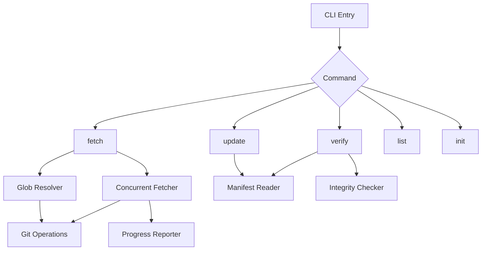

<!-- APS: Anvil Plan Specification -->
<!-- This document is non-executable. -->

# git-file-fetch v1.1 Feature Release

## Overview

Enhance git-file-fetch from a basic file fetching CLI to a comprehensive external dependency management tool. This release focuses on workflow automation (update/verify commands), developer experience improvements, and npm publishing.

## Problem & Success Criteria

**Problem:** git-file-fetch can fetch files but lacks essential workflow features for maintaining external dependencies over time. Users cannot easily update fetched files, verify they haven't drifted, or fetch multiple files using patterns.

**Success Criteria:**

- [ ] Package published to npm registry with provenance
- [ ] Users can update all manifest entries with single command
- [ ] Users can verify local files match remote sources
- [ ] Users can fetch multiple files using glob patterns
- [ ] Concurrent fetching reduces wait time for large configs
- [ ] Progress indicators show network operation status
- [ ] Shell completions available for bash/zsh/fish

## Constraints

- Must maintain backward compatibility with existing CLI and manifest format
- Must not add runtime dependencies (keep zero-dependency design)
- Must pass CI on all platforms (Linux, macOS, Windows)
- Must support Node.js 22, 23, 24

## System Map

## Milestones

### M0: npm Publishing

- **Target:** Immediate
- **Includes:** npm-publish module
- **Gate:** Package accessible via `npx git-file-fetch`

### M1: Workflow Commands

- **Target:** Sprint 1
- **Includes:** update-command, verify-command, list-command
- **Gate:** Users can manage dependencies through manifest

### M2: Power Features

- **Target:** Sprint 2
- **Includes:** glob-support, concurrent-fetch, integrity-check
- **Gate:** Performance and batch operations ready

### M3: Developer Experience

- **Target:** Sprint 3
- **Includes:** progress-indicators, shell-completion, init-command, error-hints
- **Gate:** Polished CLI experience

## Modules

| Module | Scope | Owner | Status | Priority | Tags | Dependencies |
|--------|-------|-------|--------|----------|------|--------------|
| [01-npm-publish](./modules/01-npm-publish.aps.md) | RELEASE | — | Ready | critical | npm, ci | — |
| [02-update-command](./modules/02-update-command.aps.md) | WORKFLOW | — | Draft | high | cli, manifest | npm-publish |
| [03-verify-command](./modules/03-verify-command.aps.md) | WORKFLOW | — | Draft | high | cli, manifest | npm-publish |
| [04-glob-support](./modules/04-glob-support.aps.md) | FETCH | — | Draft | high | cli, git | npm-publish |
| [05-diff-preview](./modules/05-diff-preview.aps.md) | UX | — | Draft | high | cli | npm-publish |
| [06-integrity-check](./modules/06-integrity-check.aps.md) | SECURITY | — | Draft | high | manifest, verify | verify-command |
| [07-concurrent-fetch](./modules/07-concurrent-fetch.aps.md) | PERF | — | Draft | high | fetch | npm-publish |
| [08-progress-indicators](./modules/08-progress-indicators.aps.md) | UX | — | Draft | medium | cli | npm-publish |
| [09-shell-completion](./modules/09-shell-completion.aps.md) | UX | — | Draft | medium | cli | npm-publish |
| [10-list-command](./modules/10-list-command.aps.md) | WORKFLOW | — | Draft | medium | cli, manifest | npm-publish |
| [11-init-command](./modules/11-init-command.aps.md) | UX | — | Draft | medium | cli | npm-publish |
| [12-error-hints](./modules/12-error-hints.aps.md) | UX | — | Draft | medium | cli | npm-publish |

## Risks & Mitigations

| Risk | Impact | Likelihood | Mitigation |
|------|--------|------------|------------|
| npm name `git-file-fetch` taken | high | low | Check availability before publishing |
| Glob patterns expose security holes | high | medium | Strict path validation, no `..` in patterns |
| Concurrent fetches overwhelm git | medium | medium | Configurable concurrency limit, default 4 |
| Breaking manifest format | high | low | Version field, migration path |

## Decisions

- **D-001:** Keep zero runtime dependencies — bundle any utilities needed
- **D-002:** Use SHA-256 for content integrity — matches existing remote naming
- **D-003:** Glob expansion happens client-side via git ls-tree — no new git operations

## Open Questions

- [ ] Should `update` command support `--ref` to update all entries to a new ref?
- [ ] Should `verify` return non-zero if any file differs (for CI)?
- [ ] What's the concurrency default? (4? 8? based on CPU?)

## Future Waves (v1.2+)

See [FUTURE.md](./FUTURE.md) for next-wave killer features:
- Watch mode with auto-update
- GitHub Actions native integration
- VS Code extension
- Monorepo support with workspace configs
